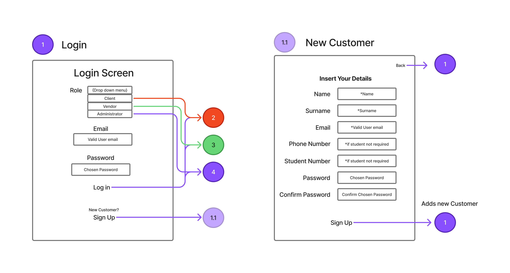
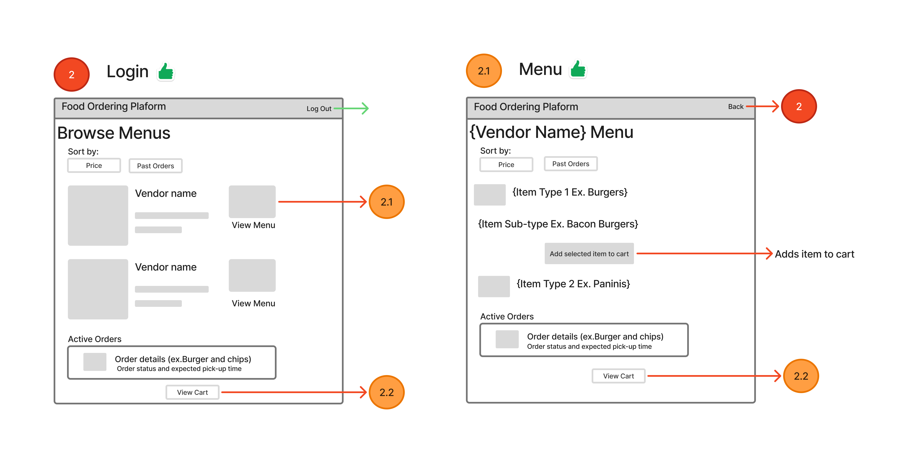
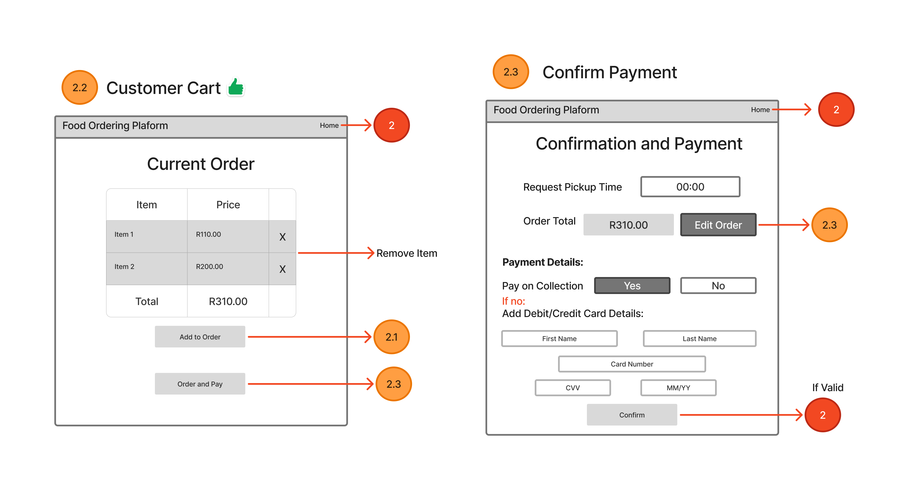
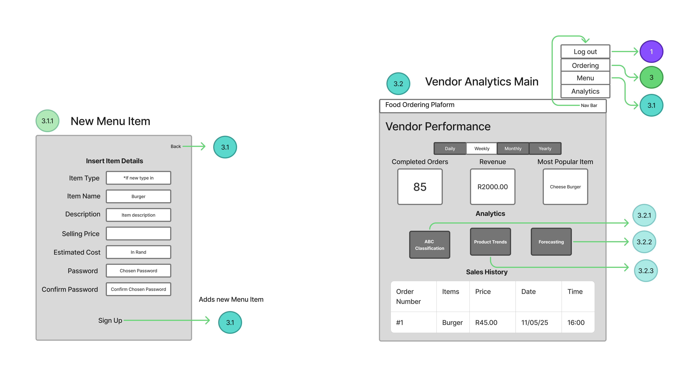
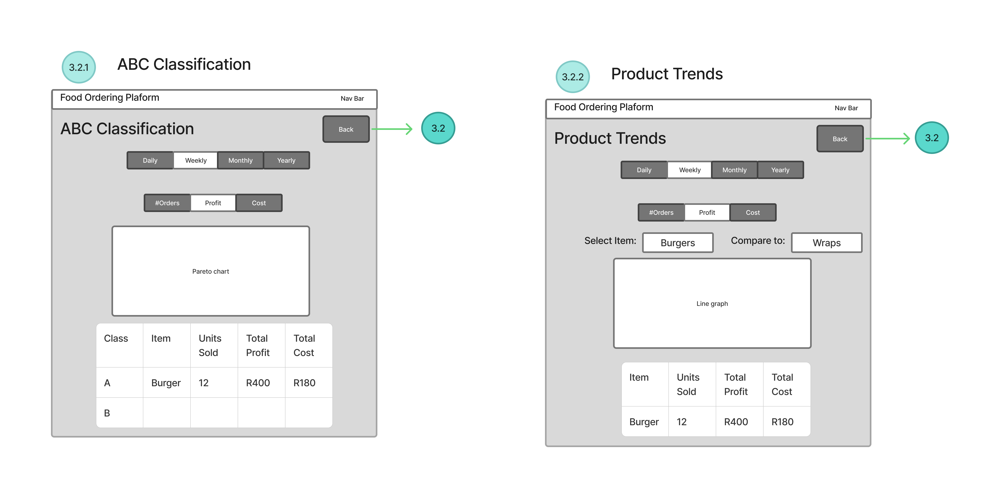
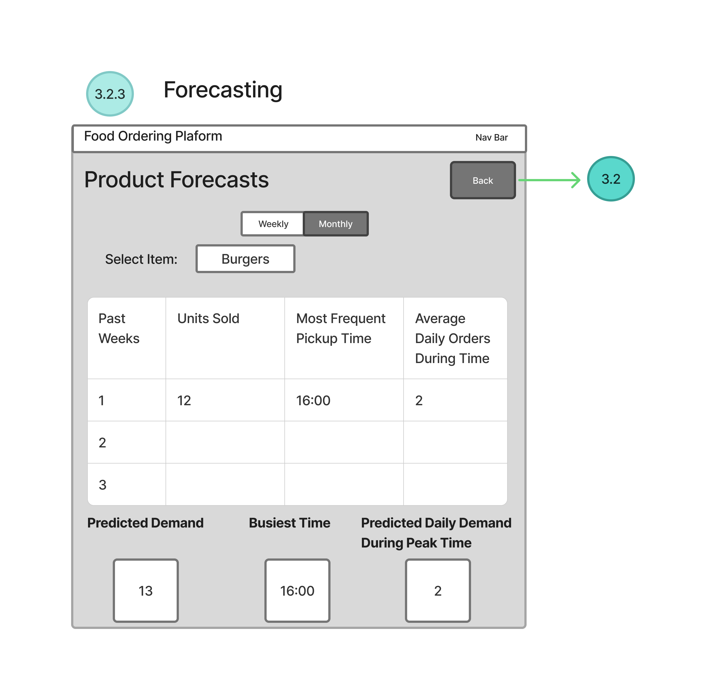
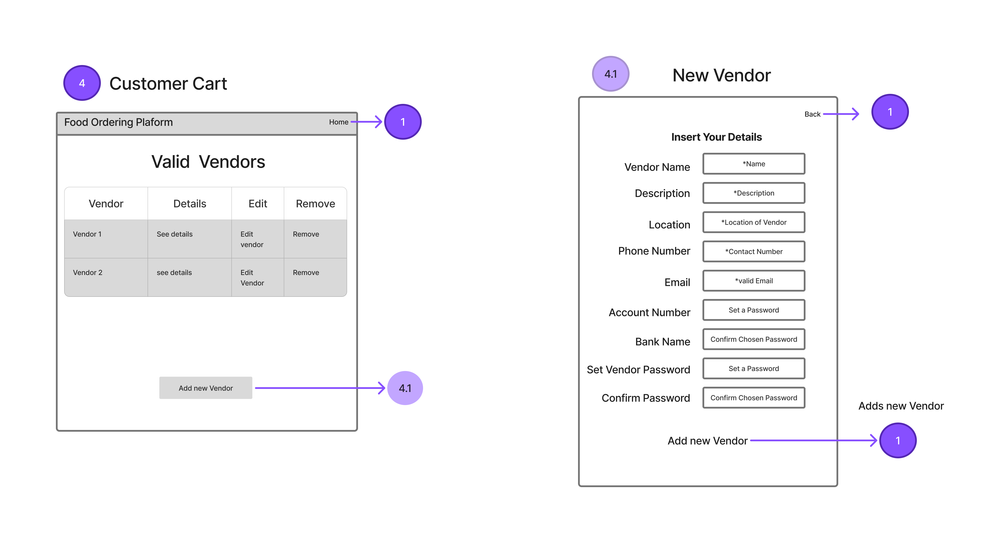

# Order Management System for Campus Restaurants

This system is designed to **supplement** the current in-person ordering process used by most campus restaurants. It offers a new avenue for generating orders that might have been lost in the past. Furthermore, this online ordering system provides restaurants with valuable insights into the data generated by orders, allowing them to make more informed decisions and potentially **increase profit**.

This project will use **TENZ** as a **case study**, basing all system functions on their business operations, including their location, menu items, and other related details.

---

## Wireframes 

Below is the wireframes designed for the web application. They give the general design of the screens and also show the flows between them. These wireframes were used to develop the web pages in HTML and using CSS and Bootstrap libraries to format the visual front-end of the web application.

## SQL Database Structure

Tables were generated using SQLite commands to store essential data for the general operation of the ordering system, including tracking **orders**, **vendors**, and **customers**.

The structure of the database tables is illustrated in the **Entity-Relationship Diagram (ERD)** below.

**

Data has been added to the database to ensure the application runs smoothly during demonstrations. Some of the data is **"dummy" data** to respect privacy, while other data, such as the menu items, is **real data** collected from the TENZ menu.

---

## User Roles and Permissions

The application supports three distinct user types, each with different permissions:

1.  **Customer User**
2.  **Admin User**
3.  **Vendor User** (e.g., a TENZ employee)

A user will be able to register for the platform. A **Vendor** will have access to all vendor-specific screens and functionalities, including:
* Adding new **menu items**.
* **Accepting and viewing** incoming orders.
* An **analytics suite** to base business decisions on.

---

## Project Current Stage (Front-End Focus)

For the current stage of the project, **not all functionalities are fully operational**. This is primarily due to the back-end of the website not yet being connected.

The current **front-end** demonstrates the logical flow of screens and processes. Since live data cannot be displayed currently, some elements have been **hardcoded** to fully showcase the intended application functions.

---

## Sample Data Included

The database has been populated with the following sample data for demonstration purposes:

* **2 Users:** One customer and one admin.
* **1 Vendor (Restaurant):** TENZ.
* **12 Menu Items:** A shortened version of the TENZ menu.
* **2 Orders:** Two historical orders to show past data.
* **Order Items:** Data detailing the specific items included in each of the two historical orders.